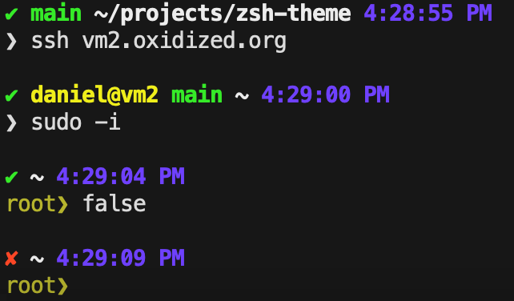

# Daniel’s ZSH theme

### An older example as text

~~~
✔ master ⚙ ~/work/simplepup 10:25:31 PM (simplepup)
❯ ssh vm1.oxidized.org

✔ daniel@vm1 master ~ 10:25:40 PM
❯
~~~

## What does it show?

  - Success (`✔`) or exist code (`=1`) of previous command
  - If connected via SSH, user and host
  - Git status
    - Current branch, or sha in detached HEAD state
    - Dirty working directory (`⚙`, color change)
  - Working directory
  - Virtualenv
  - Current time when the prompt was generated
  - Wall time of last command if it took more than 0.1 seconds
  - Root privileges (`root❯`)
  - Shows level of shell (`$SHLVL`) by repeating `❯`

## Compatibility

To test if your terminal and font support, try `echo "⚙ ✔ ✘ ⚡"`.

## License

This was originally based on [agnoster-zsh-theme][]. I believe I have replaced
enough of the code that it’s fair to say this is unencumbered by the original
copyright. (I am not a lawyer; consult a lawyer if this matters to you.)

That said, I disclaim all copyright on this work. It is provided without
warranty. As much as it can be said to be licensed, it is licensed under the
[Unlicense][], a copy of which is provided in [UNLICENSE](UNLICENSE).

[agnoster-zsh-theme]: https://github.com/agnoster/agnoster-zsh-theme
[Unlicense]: https://unlicense.org
