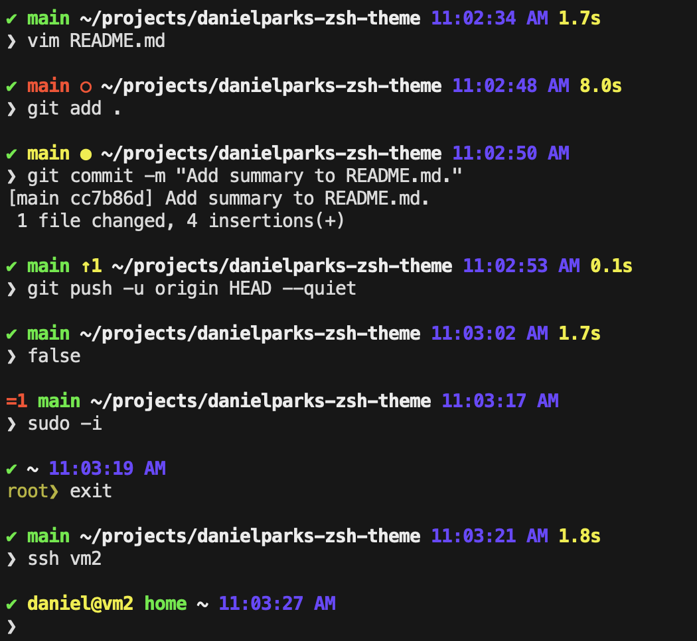

# Daniel’s ZSH theme

This is a simple two line (well, three if you count the blank) prompt for ZSH.
It is fast, allows for plenty of space to type commands, and looks good when
copied and pasted.

If [git-status-vars][] is available, it will use it to get better information
about git repos, as well as a slight edge in speed. It will warn you if it is
not present, but that can be disabled with an environment variable.

See [EXAMPLE.md][] for a uncolored text version of the screenshot.

## What does it show?

  - Success (`✔`) or exit code (`=1`) of last command
  - If connected via SSH, user and host
  - Git status using [git-status-vars][] (if available)
    - Current branch, or SHA in detached HEAD state
    - If an operation such as a merge, rebase, or cherry pick is in progress
    - Icons and color to indicate various states:
      | Icon | Color  | Meaning                            |
      |------|--------|------------------------------------|
      |      | Green  | clean tree; everything committed   |
      | `●`  | Yellow | only staged changes                |
      | `●`  | Red    | staged changes and untracked files |
      | `⦿`  | Red    | staged and unstaged changes        |
      | `○`  | Red    | only unstaged changes              |
      |      | Red    | only untracked files               |
      | `⚠️`  |        | merge conflict present             |
      | `↑N` |        | N commits ahead of upstream        |
      | `↓N` |        | N commits behind upstream          |
  - Working directory
  - Virtualenv
  - Current time when the prompt was generated
  - Wall time of last command if it took more than 0.1 seconds
  - Root privileges (`root❯`)
  - Level of shell (`$SHLVL`) by repeating `❯`

## Configuration

This warns if [git-status-vars][] is not installed. To suppress the message, set
`IGNORE_GIT_SUMMARY=1` before loading this plugin.

## Compatibility

To test your terminal and font support, try `echo "⚠️  ● ⦿ ○ ✔ ↑ ↓ ❯"`.

## Testing

This can be used with my [simple Zsh test harness][zsh-test-harness]. You can
run tests with `run-tests.zsh`, and if you want to see what prompts looks like
in various situations, you can run `run-tests.zsh --show-output`.

## License

This was originally based on [agnoster-zsh-theme][]. I believe I have replaced
enough of the code that it’s fair to say this is unencumbered by the original
copyright. (I am not a lawyer; consult a lawyer if this matters to you.)

That said, I disclaim all copyright on this work. It is provided without
warranty. As much as it can be said to be licensed, it is licensed under the
[Unlicense][], a copy of which is provided in [UNLICENSE](UNLICENSE).

[git-status-vars]: https://github.com/danielparks/git-status-vars
[EXAMPLE.md]: EXAMPLE.md
[zsh-test-harness]: https://github.com/danielparks/zsh-test-harness
[agnoster-zsh-theme]: https://github.com/agnoster/agnoster-zsh-theme
[Unlicense]: https://unlicense.org
